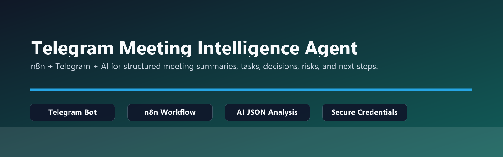
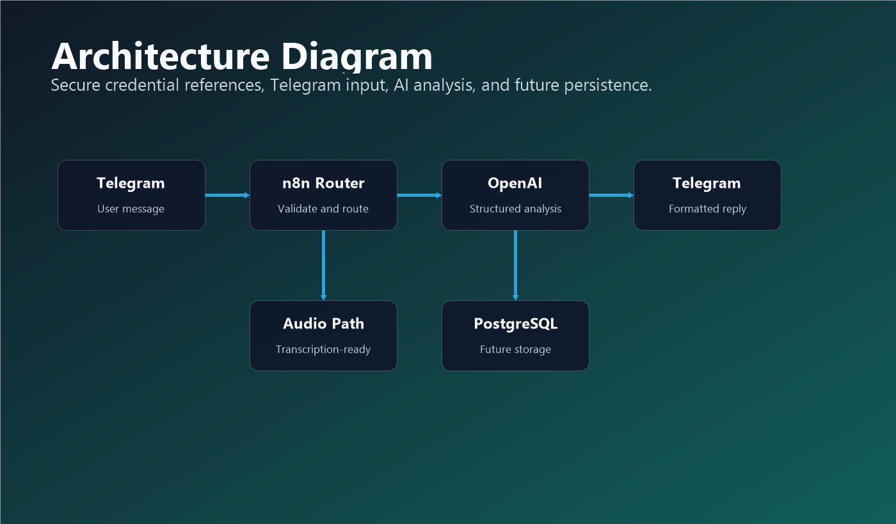
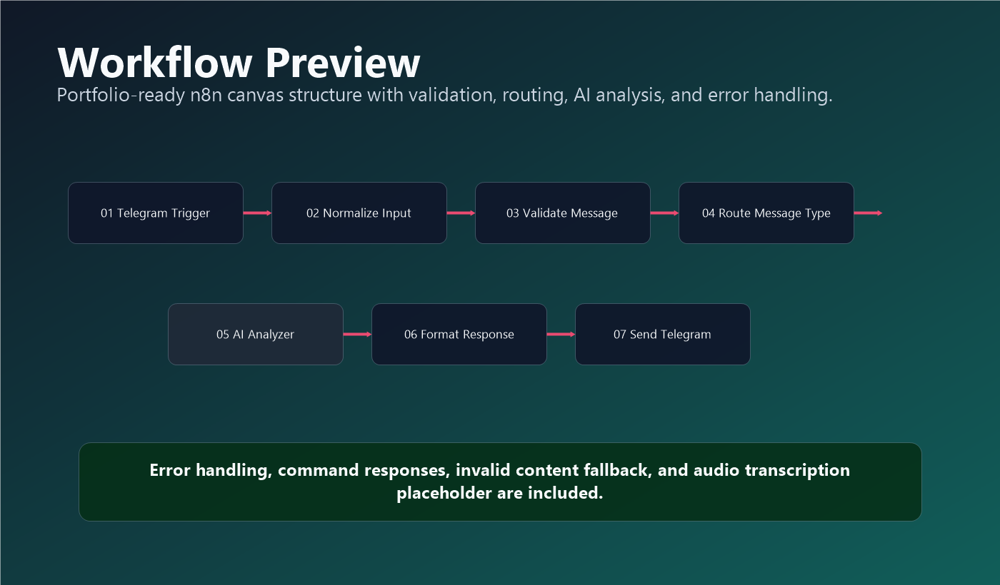
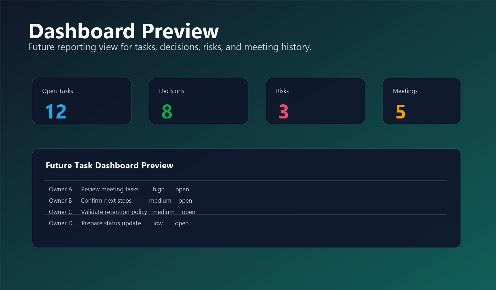

<p align="center">
  
</p>

<h1 align="center">Telegram Meeting Intelligence Agent</h1>

<p align="center">
  Automacao n8n para transformar notas de reunioes enviadas pelo Telegram em resumo executivo, decisoes, tarefas, pendencias, riscos e proximos passos.
</p>

<p align="center">
  
  
  
  
  
</p>

## Workflow n8n para Importar

> O arquivo principal do workflow n8n esta aqui:
>
> [`workflows/telegram-meeting-intelligence-agent.json`](workflows/telegram-meeting-intelligence-agent.json)

Use esse JSON no n8n em **Workflows > Import from File**. Depois de importar, abra os nodes com credenciais e selecione manualmente suas credenciais do Telegram e da OpenAI.

| Arquivo | Uso |
|---|---|
| [`workflows/telegram-meeting-intelligence-agent.json`](workflows/telegram-meeting-intelligence-agent.json) | Workflow principal para importar no n8n. |
| [`workflows/telegram-meeting-reminder-engine.json`](workflows/telegram-meeting-reminder-engine.json) | Workflow complementar para lembretes futuros. |

## 🎯 Problema que Resolve

Reunioes geram decisoes, tarefas e pendencias que se perdem rapidamente em mensagens soltas. Este projeto cria um fluxo simples para enviar notas pelo Telegram e receber uma analise estruturada pronta para acompanhamento.

## 🧠 O que a Automacao Entrega

| Saida | Descrição |
|---|---|
| Resumo executivo | Sintese objetiva da reuniao. |
| Decisoes | Lista de decisoes identificadas. |
| Acoes | Tarefas com responsavel, prazo, prioridade e status. |
| Pendencias | Pontos em aberto e dependencias. |
| Riscos | Bloqueios, incertezas e riscos operacionais. |
| Proximos passos | Lista pratica do que fazer depois. |
| Resposta Telegram | Mensagem final em formato profissional. |

## 🏗️ Arquitetura

<p align="center">
  
</p>

```text
Telegram Trigger
  -> Normalize Input
  -> Validate Message
  -> Route Message Type
      -> Command Response
      -> Text Meeting Analysis
      -> Audio Transcription Placeholder
      -> Invalid Content Response
  -> Format Telegram Response
  -> Send Telegram Response
```

## ⚙️ Funcionalidades

| Status | Funcionalidade |
|---|---|
| ✅ | Receber mensagens de texto pelo Telegram. |
| ✅ | Validar conteudo curto, vazio ou invalido. |
| ✅ | Suporte inicial aos comandos `/start`, `/nova_reuniao`, `/pendencias`, `/minhas_tarefas`, `/ajuda`. |
| ✅ | Enviar texto validado para IA com saida JSON estruturada. |
| ✅ | Formatar resposta profissional em HTML para Telegram. |
| ✅ | Identificar audio e preparar payload para transcricao futura. |
| ✅ | Tratar falha da chamada de IA com mensagem amigavel. |
| 🟡 | Persistencia em PostgreSQL preparada no schema, ainda nao obrigatoria. |
| 🟡 | Reminder engine preparado como workflow complementar. |

## 🔄 Demonstração do Fluxo

<p align="center">
  
</p>

1. O usuario envia notas da reuniao para o bot.
2. O workflow identifica se e comando, texto, audio ou conteudo invalido.
3. Texto valido e enviado para a OpenAI.
4. A IA retorna JSON estruturado.
5. O n8n formata a resposta para Telegram.
6. O usuario recebe a analise no mesmo chat.

## 🖼️ Preview de Evolucao

<p align="center">
  
</p>

## 📦 Como Instalar

```bash
git clone https://github.com/Paula-Tech007/Telegram-Meeting-Intelligence-Agent.git
cd telegram-meeting-intelligence-agent
cp .env.example .env
```

Edite apenas o arquivo `.env` local. Ele esta no `.gitignore` e nao deve ser enviado ao GitHub.

## 🤖 Como Configurar o Telegram Bot

1. Abra o Telegram.
2. Procure por `@BotFather`.
3. Execute `/newbot`.
4. Defina nome e username do bot.
5. Copie o token gerado.
6. No n8n, crie uma credencial do tipo `Telegram API`.
7. Cole o token somente dentro da credencial do n8n.
8. Importe o workflow e selecione essa credencial nos nodes Telegram.

> Nunca cole o token em arquivos JSON, README, exemplos, prints ou campos de texto do workflow.

## 🧩 Como Configurar OpenAI

1. Gere uma API key na sua conta OpenAI.
2. No n8n, crie uma credencial do tipo `OpenAI API`.
3. Cole a API key somente na credencial do n8n.
4. No node `06 - AI Meeting Analyzer`, selecione a credencial correta.

O workflow usa HTTP Request com `predefinedCredentialType` para manter a chave fora do JSON exportado.

## 📥 Como Importar no n8n

1. Abra o n8n.
2. Acesse **Workflows**.
3. Clique em **Import from File**.
4. Importe [`workflows/telegram-meeting-intelligence-agent.json`](workflows/telegram-meeting-intelligence-agent.json).
5. Abra cada node com credencial e selecione a credencial correta:
   - `01 - Telegram Trigger`
   - `06 - AI Meeting Analyzer`
   - `06C - Send Command Response`
   - `09 - Send Telegram Response`
   - `06A - Send Audio Placeholder Response`
   - `06I - Send Invalid Content Response`
   - `11 - Send Error Response`
6. Salve.
7. Ative o workflow.

## 🔐 Variaveis de Ambiente

Use `.env.example` como referencia:

```env
TELEGRAM_BOT_TOKEN=your_telegram_bot_token_here
OPENAI_API_KEY=your_openai_api_key_here
TELEGRAM_CHAT_ID=your_chat_id_here
OPENAI_MODEL=gpt-4o-mini
```

Essas variaveis sao placeholders. O workflow principal usa credenciais do n8n e nao precisa que tokens estejam no JSON.

## 📨 Exemplo de Entrada

```text
Reuniao de alinhamento do projeto. Foi decidido que a primeira versao sera integrada ao Telegram e ao n8n. O Lider Tecnico ficara responsavel por importar o workflow ate sexta-feira. Ainda falta validar a politica de retencao de dados.
```

Veja tambem: [`examples/sample-meeting-input.txt`](examples/sample-meeting-input.txt)

## 📤 Exemplo de Saida

```text
📌 Resumo da Reuniao

Resumo executivo:
...

✅ Decisoes:
1. ...

🧩 Acoes identificadas:
1. Responsavel: ...
   Tarefa: ...
   Prazo: ...
   Prioridade: ...

⚠️ Pendencias:
1. ...

🚀 Proximos passos:
1. ...

🤖 Observacoes da IA:
...
```

Veja tambem:

- [`examples/sample-ai-output.json`](examples/sample-ai-output.json)
- [`examples/sample-telegram-response.md`](examples/sample-telegram-response.md)

## 💬 Comandos Telegram

| Comando | Status | Comportamento |
|---|---|---|
| `/start` | ✅ | Apresenta o agente e comandos disponiveis. |
| `/nova_reuniao` | ✅ | Explica como enviar uma reuniao para analise. |
| `/pendencias` | 🟡 | Responde como roadmap ate persistencia ser ativada. |
| `/minhas_tarefas` | 🟡 | Responde como roadmap ate persistencia ser ativada. |
| `/ajuda` | ✅ | Mostra ajuda rapida. |

## 🗄️ Banco de Dados

O banco nao e obrigatorio na primeira versao. O schema PostgreSQL esta preparado em:

```text
database/schema.sql
```

Tabelas planejadas:

- `meetings`
- `meeting_tasks`
- `meeting_decisions`
- `meeting_risks`

## 🔒 Segurança

Este repositorio foi preparado para portfolio publico:

- Sem token real do Telegram.
- Sem API key real da OpenAI.
- Sem URL privada.
- Sem chat ID real.
- Sem dados pessoais.
- Sem dados corporativos reais.
- Sem segredos em JSON.
- Sem segredos em exemplos.

Leia: [`docs/security.md`](docs/security.md)

## 🧭 Roadmap

| Prioridade | Evolucao |
|---|---|
| Alta | Adicionar download de audio do Telegram. |
| Alta | Adicionar transcricao com OpenAI Audio ou outro provedor. |
| Alta | Persistir reunioes, tarefas e decisoes em PostgreSQL ou Data Tables. |
| Media | Implementar consulta real para `/pendencias`. |
| Media | Implementar consulta real para `/minhas_tarefas`. |
| Media | Criar dashboard de tarefas por responsavel e prazo. |
| Baixa | Adicionar aprovacao humana antes de registrar tarefas em sistemas externos. |
| Baixa | Adicionar multi-idioma e filtros por chat autorizado. |

## 📁 Estrutura do Projeto

```text
telegram-meeting-intelligence-agent/
├── README.md
├── .gitignore
├── .env.example
├── LICENSE
├── workflows/
│   ├── telegram-meeting-intelligence-agent.json
│   └── telegram-meeting-reminder-engine.json
├── prompts/
│   ├── meeting-analysis-system-prompt.md
│   ├── task-extraction-prompt.md
│   └── telegram-response-template.md
├── docs/
│   ├── architecture.md
│   ├── setup-guide.md
│   ├── security.md
│   ├── use-cases.md
│   └── screenshots/
├── assets/
│   ├── banner.png
│   ├── architecture-diagram.png
│   ├── workflow-preview.png
│   └── dashboard-preview.png
├── database/
│   └── schema.sql
└── examples/
    ├── sample-meeting-input.txt
    ├── sample-ai-output.json
    └── sample-telegram-response.md
```

## 🧪 Como Testar no n8n

1. Importe o workflow principal.
2. Selecione credenciais Telegram e OpenAI manualmente.
3. Ative o workflow.
4. Abra uma conversa com o bot.
5. Envie `/start`.
6. Envie um texto de reuniao ficticio.
7. Confira a resposta formatada.
8. Teste uma mensagem curta para validar o fallback.
9. Envie um audio para validar o payload de transcricao preparado.

## 📸 Screenshots

Use a pasta [`docs/screenshots`](docs/screenshots) para imagens reais do projeto.

Antes de commitar prints, confira se nao ha:

- Tokens
- API keys
- Chat IDs reais
- URLs privadas
- Dados pessoais
- Dados corporativos

## 📄 Licenca

MIT. Veja [`LICENSE`](LICENSE).

## 👤 Creditos

Projeto criado para fins educacionais, demonstracao tecnica e portfolio profissional em automacao com n8n, Telegram e IA generativa.

Autor: Paula Sabino
